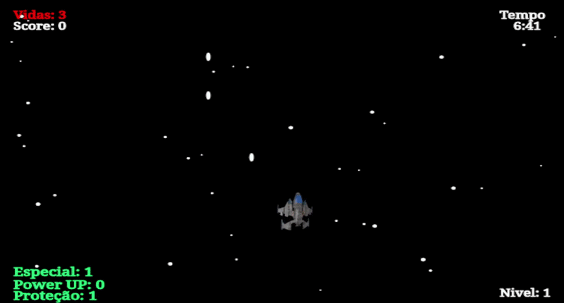
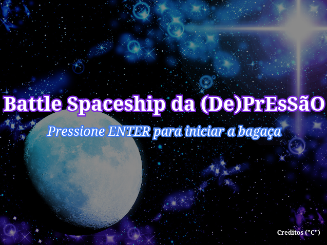
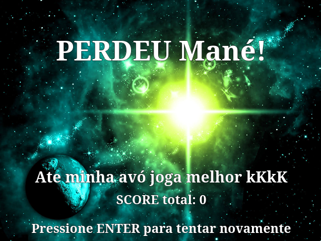

# 🚀 Battle Spaceship Game

> **From a university programming course project to a Software Engineering case study.**

This repository preserves the original implementation of my first programming project and documents its evolution into a professionally structured software architecture through incremental refactoring and modern engineering practices.

<p align="left">
  
  
  
  
  
  
  
</p>

## Project Status

| Current Version | Next Milestone              |
| :---:           | :---                        |
| **v1.0.1**      | JavaScript Refactoring (v2) |

## 📖 About

**Battle Spaceship Game** is a 2D space shooter originally developed in **2019** as the final project for an introductory programming course at the **Federal University of Rio Grande do Norte (UFRN)**.

Rather than replacing the original implementation, this repository preserves it as the project's historical baseline while documenting its evolution through modern software engineering practices.

The goal is to transform a beginner's academic project into a maintainable, modular, and scalable application without changing its original gameplay experience.

This repository serves as a practical study of software architecture, refactoring, and long-term project evolution.

## 📚 Project Background

In **2019**, during my first contact with software development, I developed this game as the final project for the **Logic of Programming** course at the **School of Science and Technology (ECT)** of the **Federal University of Rio Grande do Norte (UFRN)**.

The project was built using **JavaScript** and the **p5.js** library, applying only the programming concepts covered during the course, such as variables, conditionals, loops, functions, and basic object manipulation.

The project received the maximum grade (**10/10**). During the evaluation, the professor highlighted the implementation of the scene transition system, recognizing the organization of the game's flow between menus, gameplay, cutscenes, and game over screens.

At the time, this solution was developed intuitively, before I had any formal knowledge of software architecture, state management, design patterns, or software engineering principles.

Looking back today, it is interesting to recognize that the project already contained the foundations of what is commonly known as a **Scene Manager**. Preserving this implementation allows me to document not only the final result, but also the reasoning and evolution that transformed an academic assignment into a long-term software engineering study.

## 📈 Project Evolution

Instead of replacing the original implementation, this repository follows an incremental evolution strategy. Each version represents a distinct milestone in the project's technical maturity while preserving its history.

### 🌟 Version 1 — Historical Baseline

The original implementation developed in **2019**.

This version is intentionally preserved with minimal modifications. It represents the project's starting point and provides historical context for every architectural decision introduced in later versions.

**Objectives**

* Preserve the original source code.
* Document the initial project structure.
* Keep the original gameplay unchanged.
* Apply only essential fixes that preserve the original implementation, such as critical stability fixes, documentation improvements, licensing updates, and repository organization.

---

### ⚙️ Version 2 — JavaScript Architecture Refactoring

The second milestone focuses entirely on software engineering.

Without changing the gameplay, the project will be progressively reorganized into a modular and maintainable architecture using modern JavaScript.

**Main Goals**

* Introduce a feature-oriented architecture.
* Eliminate unnecessary global state.
* Improve separation of concerns.
* Apply SOLID principles.
* Reduce code duplication (DRY).
* Increase cohesion and reduce coupling.
* Improve maintainability and extensibility.
* Prepare the codebase for TypeScript migration.

**Planned Refactoring**

* Scene Management
* Entity Extraction
* Collision System
* Input System
* Rendering System
* Audio System
* Configuration Management
* Game State Management
* Asset Management

---

### 🛡️ Version 3 — TypeScript Migration

Once the JavaScript architecture becomes stable, the entire project will be migrated to TypeScript.

This migration will prioritize maintainability and type safety rather than introducing new gameplay features.

**Main Goals**

* Strong typing.
* Interfaces and contracts.
* Improved developer experience.
* Better tooling support.
* Safer refactoring.
* Long-term maintainability.

## 📸 Media Showcase

The following visuals illustrate the current state of the project (**Version 1**).

### 🎮 Gameplay Demo

The core gameplay loop featuring real-time mechanics and physics.

<p align="center">
  
</p>

---

### 🖥️ Interface & Flow

A breakdown of the user experience, from the initial entry to the final state.

<p align="center">
  
  
</p>

--- 

## 🎮 Features

Battle Spaceship Game is a classic 2D space shooter built around fast-paced gameplay and progressive difficulty.

### Gameplay

* Control a spaceship and survive enemy waves.
* Shoot hostile aircraft and avoid incoming attacks.
* Activate defensive shields to protect the ship.
* Use a special attack during critical moments.
* Progress through increasingly difficult stages.

### Game Systems

* Multiple game scenes (menu, intro, gameplay and game over).
* Progressive difficulty scaling.
* Score tracking.
* Enemy spawning system.
* Collision detection.
* Explosion animations.
* Sound effects and background music.

### Technical Highlights

Even in its original implementation, the project already introduced concepts that would later be formalized during the refactoring process, including:

* Scene transitions.
* Entity management using arrays.
* Separation between asset loading and gameplay.
* Independent gameplay systems with clear responsibilities.

## 🎯 Controls

|     Key     | Action                   |
| :---------: | ------------------------ |
| **W A S D** | Move the spaceship       |
|    **↑**    | Fire primary weapon      |
|    **↓**    | Activate shield          |
|  **Space**  | Launch special attack    |
|  **Enter**  | Start / Restart the game |
|   **Esc**   | Pause the game           |

## 🛠️ Technologies

### Current Stack (Version 1)

* JavaScript (ES5/ES6)
* [p5.js](https://p5js.org/)
* HTML5
* CSS3

---

### Planned Tooling (Version 2)

The refactoring process will introduce a modern JavaScript development environment, including:

* Node.js
* npm
* ESLint
* Prettier
* EditorConfig
* Vitest

---

### Future Stack (Version 3)

After the JavaScript architecture becomes stable, the project will migrate to:

* TypeScript

## 🌳 Branch Strategy

This repository follows a simplified Git workflow designed to preserve the project's history while supporting incremental architectural improvements.

### Main Branches

| Branch      | Purpose                                 |
| ----------- | --------------------------------------- |
| `main`    | Stable releases (`v1`, `v2`, `v3`)      |
| `develop` | Integration branch for the next release |

### Feature Branches

As the project grows, new features and refactorings will be developed in dedicated branches following the convention:

`feature/<feature-name>`

**Examples:**
* `feature/scene-manager`
* `feature/player`
* `feature/collision-system`
* `feature/audio-system`
* `feature/typescript-migration`

This strategy keeps the project history organized and allows each architectural improvement to be reviewed independently before being merged into the main development branch.

## 📝 Commit Convention

This project follows the [Conventional Commits](https://www.conventionalcommits.org/) specification to keep the Git history consistent, readable, and easy to navigate.

### Structure
`<type>: <description>`

### Examples
* `feat: add collision system` — *for new features*
* `fix: prevent player from leaving screen` — *for bug fixes*
* `refactor: extract scene manager` — *for code changes that neither fix a bug nor add a feature*
* `docs: improve README` — *for documentation changes*
* `style: format project with Prettier` — *for formatting changes*
* `test: add collision unit tests` — *for adding or correcting tests*
* `chore: update development tooling` — *for updating tooling/configs*

Each commit should represent a single logical change, making the project's evolution easier to understand and review.

## 🏗️ Architecture Roadmap

The project will evolve incrementally while preserving the original gameplay experience.

```text
Version 1 (2019)
│
├── Monolithic Architecture
├── Single sketch.js file
├── Global state
└── Original implementation
        │
        ▼
Version 2
│
├── Modular Architecture
├── Scene Management
├── Entity System
├── Rendering System
├── Collision System
├── Input System
├── Audio System
├── Configuration Management
└── Clean JavaScript Architecture
        │
        ▼
Version 3
│
├── TypeScript Migration
├── Strong Typing
├── Interfaces
├── Tooling
└── Automated Testing
```

Each milestone introduces architectural improvements while preserving the project's history and original gameplay.

## 🎯 Engineering Principles

The refactoring process is guided by a small set of engineering principles that prioritize long-term maintainability over short-term implementation speed.

The project aims to follow:

* Single Responsibility Principle (SRP)
* Open/Closed Principle (OCP)
* Dependency Inversion Principle (DIP)
* Composition over Inheritance
* Low Coupling
* High Cohesion
* DRY (Don't Repeat Yourself)
* KISS (Keep It Simple, Stupid)
* Feature-Oriented Organization
* Incremental Refactoring

These principles are introduced progressively throughout the project's evolution rather than being applied all at once.

## 🚀 Running the Project

### Requirements

To run **Version 1**, you only need:

* A modern web browser
* Visual Studio Code (recommended)
* Live Server extension (recommended)

### Clone the Repository

```bash
git clone https://github.com/ladsonsa/battle-spaceship-game.git
```

### Run Locally

Open the project folder in **Visual Studio Code**.

You can either:

* Open `index.html` directly in your browser.
* Run the project using the **Live Server** extension (recommended).

### Notes

Version 1 intentionally preserves the original project structure and development workflow.

Future versions will introduce a modern JavaScript toolchain, including package management, linting, formatting, testing, and build automation.

## 📂 Repository Structure

The current repository reflects the original project organization from **Version 1**.

```text
.
├── imagens/          # Game sprites and visual assets
├── sons/             # Sound effects and background music
├── video/            # Intro and ending videos
├── index.html        # Application entry point
├── sketch.js         # Main game implementation
├── style.css         # User interface styling
├── README.md         # Project documentation
├── LICENSE           # Licensing information
└── .gitignore        # Git ignore rules
```

### Project Organization

At this stage, the game logic is concentrated in a single `sketch.js` file, following the approach adopted during the original academic project.

One of the primary objectives of **Version 2** is to progressively decompose this implementation into cohesive modules while preserving the original gameplay and behavior.

## 📅 Development Roadmap

The project evolves through well-defined milestones. Each version introduces architectural improvements while preserving the original gameplay experience.

| Version    | Status | Objective                                                                                  |
| ---------- | :----: | ------------------------------------------------------------------------------------------ |
| **v1.0.1** |   ✅   | Preserve the original implementation as the historical baseline while applying only critical stability fixes. |
| **v2.0.0** |   🚧   | Refactor the JavaScript architecture using modern software engineering principles.         |
| **v3.0.0** |   ⏳   | Migrate the stabilized architecture to TypeScript with strong typing and improved tooling. |

### Planned Evolution

#### Version 2

* Modular architecture
* Scene Management
* Entity System
* Rendering System
* Collision System
* Input System
* Audio System
* Configuration Management
* Asset Management
* Clean Code
* SOLID principles
* Automated testing

#### Version 3

* TypeScript migration
* Interfaces and contracts
* Strong typing
* Improved tooling
* Safer refactoring
* Long-term maintainability

## 🎨 Media Assets

This repository preserves the original media assets used in the 2019 academic project whenever possible to maintain its historical authenticity.

### Source Code

All source code contained in this repository was written by me and is released under the MIT License.

### Third-Party Assets

Some images, audio files, and videos included in **Version 1** were collected during the original development of the project as part of a non-commercial academic assignment.

The original licensing information for some of these assets could not be verified.

Their intellectual property remains with their respective copyright holders.

### Future Improvements

As part of the Version 2 refactoring, third-party assets will be progressively reviewed and, when necessary, replaced with assets distributed under verified open licenses (such as CC0 or Creative Commons) or with original content.

If you are the copyright owner of any media asset contained in this repository and believe it has been used inappropriately, please open an Issue or contact me so the material can be reviewed or removed.

## 📚 Learning Goals

This repository is more than a game project. It is a long-term software engineering study focused on the continuous evolution of code quality and architectural design.

Throughout its development, the project aims to explore and apply concepts such as:

### Software Engineering

* Software Architecture
* Incremental Refactoring
* Clean Code
* SOLID Principles
* Design Patterns
* Maintainability
* Scalability

### Development Practices

* Git Workflow
* Conventional Commits
* Documentation-Driven Development
* Code Reviews
* Versioning Strategy

### Technical Skills

* Modern JavaScript
* TypeScript
* Automated Testing
* Static Analysis
* Code Formatting
* Dependency Management

Each milestone represents an opportunity to improve not only the project itself, but also the engineering practices used throughout its development.

## 🙏 Acknowledgments

This project marks the beginning of my journey in software development.

What started as an academic assignment has become a long-term software engineering study, documenting not only the evolution of the codebase but also my growth as a developer.

I would like to thank the professors and colleagues who contributed to my learning throughout this journey, as well as the open-source community whose tools and resources continue to make projects like this possible.

---

## 📄 License

The source code of this project is licensed under the **MIT License**.

Some third-party media assets included in **Version 1** are **not covered** by the MIT License and remain the intellectual property of their respective copyright holders.

For complete licensing information, please refer to the **LICENSE** file.
